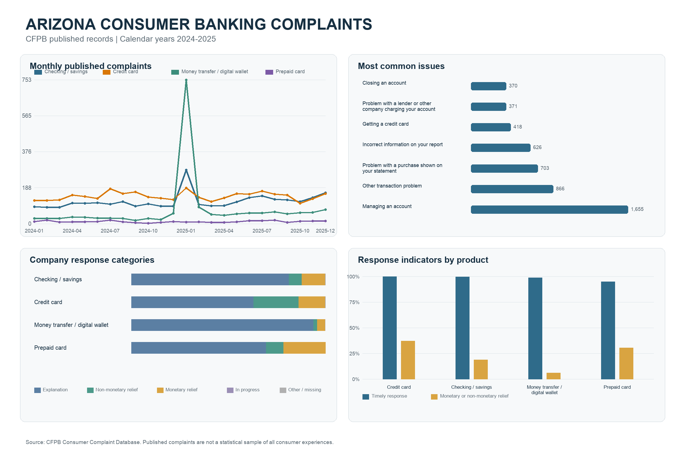
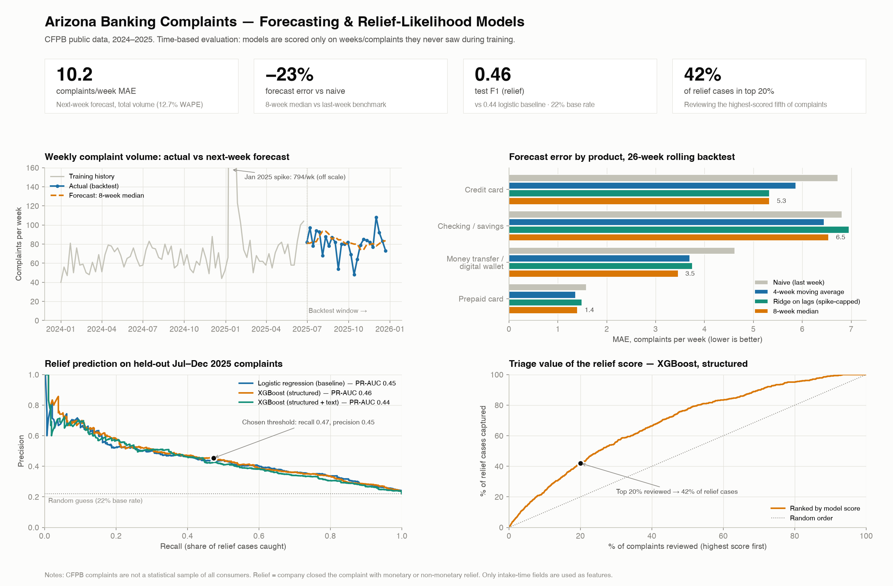

# Arizona Consumer Banking Complaint Analytics

An end-to-end analytics project on the U.S. Consumer Financial Protection Bureau (CFPB) Consumer Complaint Database: data validation, SQL analysis, an executive dashboard, a weekly volume forecast, and a model that ranks incoming complaints by their likelihood of ending in company-reported relief. This repository includes the frozen source CSV, code, and generated outputs needed to rebuild the analysis offline. Thresholded model metrics can vary slightly across native builds; see the verification notes below.





## Business questions

1. **Workload:** Which complaint categories create the largest operational workload in Arizona consumer banking, how did volume change from 2024 to 2025, and which issues should an operations team monitor first?
2. **Staffing:** How many complaints should the team expect next week, overall and by product?
3. **Triage:** At intake, which complaints are most likely to end with the company providing monetary or non-monetary relief, so they can be routed to an experienced reviewer earlier?

## Scope

- Geography: Arizona
- Period: January 1, 2024 through December 31, 2025
- Products: checking/savings accounts, credit cards, prepaid cards, and money transfer/digital wallet services
- Source fields: 16
- Source: [CFPB Consumer Complaint Database](https://www.consumerfinance.gov/data-research/consumer-complaints/), frozen 16-field export at `data/raw/cfpb_az_banking_complaints_2024_2025.csv`.
- Raw CSV SHA-256: `9525db0ace5e65557f8c4a3ddb237383c555fb8db87e62f5a45f85e6224045b1`. The exact original API query and export timestamp were not preserved; the included snapshot is the reproducibility source of record. A fresh CFPB download may differ because the public database changes.

## Results

### 1. Descriptive analysis (Python + SQLite + SQL)

- Processed **8,279** in-scope complaints with unique complaint IDs across 16 source fields.
- Published volume rose **46.7%**, from 3,356 complaints in 2024 to 4,923 in 2025.
- A January 2025 money-transfer/digital-wallet spike accounted for **46.3%** of the total year-over-year increase; **92.0%** of that spike came from two companies.
- Identified **257** records sharing narrative text inside the spike while preserving their unique complaint IDs for review. Repeated text does not prove duplicate complaints.
- Timely-response indicator: 99.34%; closed with monetary or non-monetary relief: 24.01%.

### 2. Weekly volume forecast

Rolling-origin backtest over the last 26 full weeks of 2025 (Jun 30 – Dec 22). Each week is forecast using only earlier weeks.

| Method (total volume) | MAE (complaints/week) | MAPE | WAPE |
|---|---:|---:|---:|
| Naive (last week) | 13.19 | 17.5% | 16.4% |
| 4-week moving average | 10.64 | 14.8% | 13.3% |
| Ridge regression on lags (spike-capped) | 10.98 | 14.4% | 13.7% |
| **8-week rolling median** | **10.17** | **14.2%** | **12.7%** |

- The 8-week median cut forecast error by **22.9%** versus the naive benchmark (average actual volume: 80.3 complaints/week).
- The lag-feature regression did **not** beat the robust median, so the simpler method is recommended. The median is resistant to one-off surges like January 2025, which otherwise inflate the next weeks' forecasts.
- Product-level results (MAE, complaints/week, 8-week median): credit card 5.3, checking/savings 6.5, money transfer 3.5, prepaid 1.4. Low-volume series (prepaid, ~2–3 per week) have high percentage errors, so WAPE and MAE are reported alongside MAPE.

### 3. Relief-likelihood model (Logistic Regression vs XGBoost)

- **Target:** complaint closed with monetary or non-monetary relief (24.6% of training complaints, 22.1% of test complaints).
- **Features:** only fields available when a complaint arrives: product, sub-product, issue, sub-issue, company (top 25 + other), submission channel, ZIP3, Older American / Servicemember tags, narrative presence/length, and (for one variant) TF-IDF of the narrative.
- **Leakage controls:** company response, public response, timely-response flag, and send date are excluded because they are only known after the company acts.
- **Time-based split:** train Jan 2024–Mar 2025 (5,182), validation Apr–Jun 2025 (974) for model selection and threshold choice, test Jul–Dec 2025 (2,123) scored once.

| Model (held-out test, Jul–Dec 2025; reference macOS run) | F1 | Precision | Recall | PR-AUC | ROC-AUC |
|---|---:|---:|---:|---:|---:|
| Logistic regression (baseline) | 0.44 | 0.44 | 0.44 | 0.45 | 0.74 |
| **XGBoost, structured fields (selected)** | **0.46** | **0.45** | **0.47** | **0.46** | **0.74** |
| XGBoost, structured + narrative text | 0.46 | 0.39 | 0.55 | 0.44 | 0.72 |

- At the validation-chosen threshold, precision was **0.45**, versus a 0.22 test-period base rate. Reviewing the top-scored **20%** of complaints captures **42%** of all cases marked as ending in relief. The top-20% ranking and the thresholded classifier are two different operating rules.
- Adding narrative text did not improve results on held-out data, and only ~59% of complaints have a narrative at all.
- Performance is lower on the test window than on validation (F1 0.46 vs 0.59). The positive rate also fell, from about 25% in validation to 22% in test; this suggests a distribution change but does not by itself establish the cause. Any operational use would need monitoring and fresh validation.
- The strongest signals were product group, specific issues/sub-issues, and company; credit-card complaints had the highest actual relief rate in the test window (30.8%) and money-transfer complaints the lowest (10.0%).

**Cross-platform reproducibility:** The table shows the verified macOS ARM run with Python 3.14 and the pinned packages in `requirements.txt`. A separate Linux run was reported to produce about 0.47 F1 and 0.52 recall for the selected model, while PR-AUC and top-20% capture still rounded to 0.46 and 42%. Its raw run files were not available for independent inspection here. The validation-selected threshold makes recall sensitive to small prediction differences. `src/verify_results.py` therefore requires the input checksum, SQLite contents, split sizes, exported flags, and reported metrics to agree exactly within reporting precision; it accepts a narrow observed range for model performance and records the actual platform and versions. Resume bullets use a conservative approximate F1 and the stable top-20% capture result.

## Workflow

1. `src/analyze.py`: load and validate the raw CSV; standardize dates and categories; remove out-of-window rows and duplicate IDs; build indicators; load SQLite; run SQL aggregations and window functions; export tables, findings, and the executive dashboard.
2. `src/forecast_volume.py`: build weekly counts by product and run the rolling backtest.
3. `src/model_relief.py`: build intake-time features, train/validate/test three classifiers, and export metrics, scores, and feature importance.
4. `src/build_model_dashboard.py`: render the forecasting and relief-likelihood dashboard.
5. `src/write_model_report.py`: update the findings report from the generated metrics.
6. `src/verify_results.py`: check the input checksum, SQL table, resume-facing numbers, and agreement between exported flags and reported scores.

## Reproduce

Use Python 3.13 or 3.14 and install the pinned dependencies in a fresh virtual environment. This project was directly verified here on macOS with Python 3.14:

```bash
python3 -m venv .venv
source .venv/bin/activate
python -m pip install -r requirements.txt
bash run_all.sh
```

The runner rebuilds the cleaned CSV and SQLite database, descriptive tables, both dashboards, forecast and model outputs, findings report, and `analysis/reproducibility_check.json`. It exits with an error if the frozen input, SQL results, score/report consistency, or performance guardrails change. Set `PYTHON_BIN=/path/to/python` to use a specific Python installation. The dashboard code uses Arial when available and falls back to DejaVu Sans elsewhere.

## Repository layout

```
data/raw/                 CFPB export used for this project
data/processed/           cleaned CSV + SQLite database (generated)
sql/analysis_queries.sql  SQL used for the descriptive analysis
src/                      Python pipeline
analysis/                 descriptive output tables and key_findings.json
analysis/modeling/        forecast and model metrics, predictions, importances
figures/                  dashboards
report/executive_findings.md
analysis/reproducibility_check.json  generated verification summary
```

## Interpretation limits

- The CFPB complaint database is not a statistical sample of all consumer experiences. Volume depends on company size, product usage, consumer reporting behavior, and publication rules. This project uses volume as an operational workload signal and does not rank company quality.
- "Relief" reflects how companies reported closing the complaint, not an independent judgment of who was right.
- Two years of weekly data (104 weeks) is a short history; the forecast does not model yearly seasonality.
- The research model includes company, ZIP3, Older American, and Servicemember fields. These may encode company policy, geography, or protected-group proxies. Evaluate fairness and portability before any operational use; do not use this score to decide outcomes or deprioritize a consumer's complaint.
- The dashboard is a static Python-generated PNG. This project does not claim Tableau, Power BI, or a deployed application.
